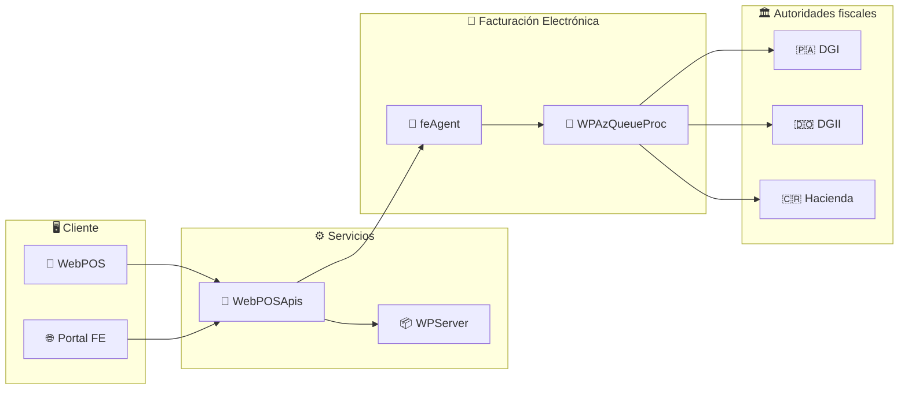
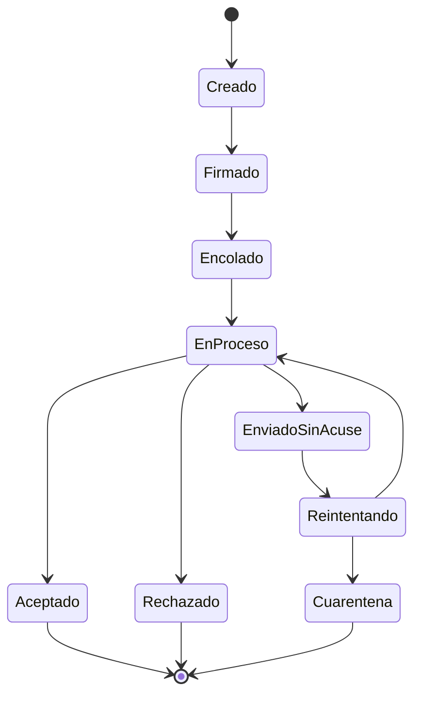

<div align="center">


# 🧾 WebPOS Online

### ☁️ Software comercial en la nube para el retail y la facturación electrónica en Latinoamérica

<br/>

[](#-referencias-fiscales-oficiales)
[](#-referencias-fiscales-oficiales)
[](#-referencias-fiscales-oficiales)

<br/>


</div>

<div align="center">

```
─────────────────────────────────────────────────────────────
   POS en la nube  ·  Facturación electrónica  ·  Multipaís
─────────────────────────────────────────────────────────────
```

</div>

---

## 🎯 ¿Qué hacemos?

Construimos y operamos una **plataforma de punto de venta en la nube** junto con todo el
ecosistema de servicios que la rodea: APIs de negocio, agentes de facturación
electrónica, portales de consulta para clientes y herramientas internas de
soporte y administración.

<table>
<tr>
<td width="33%" valign="top">

### 🛒 Punto de venta & APIs

WebPOS y su capa de servicios: ventas, inventario, cierres de caja e integraciones con terceros.

</td>
<td width="33%" valign="top">

### 🧾 Facturación electrónica

Firmado, encolado, envío y consulta de documentos fiscales ante **DGI** 🇵🇦, **DGII** 🇩🇴 y **Hacienda** 🇨🇷.

</td>
<td width="33%" valign="top">

### 🛠️ Herramientas internas

Backoffice, portal de soporte y automatización de despliegues para un equipo pequeño que atiende varios países.

</td>
</tr>
</table>

> [!NOTE]
> 🌎 Cada producto se despliega bajo **configuración por país**: catálogos fiscales,
> plantillas, reglas de validación y archivos de traducción JSON independientes por mercado.
> Nada se codifica para un solo país.

---

## 🗺️ Arquitectura en un vistazo



---

## 📚 Repositorios

### 🏛️ Núcleo del producto

| | Repositorio | Descripción | Stack |
|:--:|---|---|---|
| 🛒 | **[`WebPOS`](https://github.com/webpos-onlline/WebPOS)** | Aplicación de punto de venta en la nube. Incluye el portal **FFO** de documentos fiscales. |    |
| 🔌 | **[`WebPOSApis`](https://github.com/webpos-onlline/WebPOSApis)** | Capa de APIs de negocio. Manejo centralizado de errores con `DelegatingHandler`, `ApiExceptionFilter` y patrón *Result Wrapper*. | -512BD4?style=flat-square&logo=dotnet&logoColor=white)  |
| 📦 | **[`WPServer`](https://github.com/webpos-onlline/WPServer)** | Servidor de recursos y despliegue de assets por país: plantillas HTML, controladores JS, CSS y traducciones JSON. |   |
| 🌐 | **[`WPPortalFE`](https://github.com/webpos-onlline/WPPortalFE)** | Front-end del Portal FE. Consume `WebPOSApis`. CI/CD con GitHub Actions y publicación de artefactos a SharePoint vía Microsoft Graph. |   |

<br/>

### 🧾 Facturación electrónica

| | Repositorio | Descripción | Stack |
|:--:|---|---|---|
| 🤖 | **[`WPAgent`](https://github.com/webpos-onlline/WPAgent)** · **[`feAgent`](https://github.com/webpos-onlline/feAgent)** | Agente de facturación electrónica: emisión, consulta, **descarga masiva de PDF/XML** y reenvío de correos. Multipaís 🇵🇦 🇩🇴 🇨🇷. |   |
| 📨 | **[`WPAzQueueProc`](https://github.com/webpos-onlline/WPAzQueueProc)** | Dispatcher CLI para el procesamiento de colas de facturación electrónica sobre Azure Service Bus / MSMQ. |   |

<details>
<summary><b>🔄 Migración en curso — del pipeline MSMQ a Azure Service Bus</b></summary>

<br/>

El pipeline `FFO → MSMQ → servicio de Windows → DGI` se está migrando a **Azure Service Bus**
con un enfoque **strangler fig**, resolviendo los cuellos de botella históricos de la cola
y los bloqueos del servicio.

**Máquina de estados explícita:**



| ✅ | Garantía de diseño |
|:--:|---|
| 🔐 | Transiciones **write-ahead** con `UPDATE` guardados para concurrencia segura |
| 🔑 | Claves de **idempotencia deterministas** |
| 🧹 | Trabajos separados de **reaper** y **reconciler** |
| ⚡ | SQL directo sobre el *change tracker* de EF6 donde la precisión importa |

</details>

<br/>

### 🚀 Plataformas nuevas

| | Repositorio | Descripción | Stack |
|:--:|---|---|---|
| 🏢 | **[`WPBackOffice`](https://github.com/webpos-onlline/WPBackOffice)** | Backoffice interno. Envuelve las BLL legadas (.NET 4.8) mediante una capa adaptadora con **Clean Architecture**. |    |
| 🎫 | **[`support-portal`](https://github.com/webpos-onlline/support-portal)** | Portal de soporte multipaís. Dos apps Angular (`portal-public` y `admin`), middleware de contexto por país y auth JWT de agentes. |     |
| 🧠 | **[`AgentOS`](https://github.com/webpos-onlline/AgentOS)** | Plataforma de agentes de IA para dispositivos **edge** (Raspberry Pi) en local del cliente. Agentes verticales descargables y licenciamiento por hardware (CPU/MAC/TPM). |    |

---

## 🧰 Stack tecnológico

<div align="center">

**⚙️ Back-end**


**🎨 Front-end**


**🗄️ Datos & mensajería**


**🚢 Infra & CI/CD**


</div>

---

## 🤝 Cómo trabajamos

| | Práctica | Detalle |
|:--:|---|---|
| 🌿 | **Git Flow simplificado** | Ramas `feature/*`, `release/*`, `hotfix/*` sobre `develop` y `main` |
| 📝 | **Conventional Commits** | `feat:` · `fix:` · `refactor:` · `docs:` · `chore:` |
| 👀 | **Revisión por PR** | Obligatoria antes de integrar. Sin merge directo a `develop` |
| 🔀 | **Rebase antes de integrar** | Historial lineal y legible |
| 🌎 | **Configuración por país** | Ciudadano de primera clase, no un parche |
| 🧬 | **Migración incremental** | Estrangulamos lo legado en vez de reescribirlo de cero |

---

## 🔗 Enlaces de interés

| | Recurso | |
|:--:|---|---|
| 📖 | **Documentación técnica interna** | [Wiki de la organización](https://github.com/webpos-onlline/WebPOS/wiki) |
| 📐 | **Convenciones de Git y PR** | [`CONTRIBUTING.md`](https://github.com/webpos-onlline/.github/blob/main/CONTRIBUTING.md) |
| 🗂️ | **Tableros de trabajo** | [GitHub Projects](https://github.com/orgs/webpos-onlline/projects) |
| 🎫 | **Reporte de incidencias** | Portal de soporte (`support-portal`) |
| 👥 | **Equipos** | [Teams](https://github.com/orgs/webpos-onlline/teams) |

### 🏛️ Referencias fiscales oficiales

| | País | Entidad | Enlace |
|:--:|---|---|---|
| 🇵🇦 | Panamá | Dirección General de Ingresos | [dgi.mef.gob.pa](https://dgi.mef.gob.pa/) |
| 🇩🇴 | República Dominicana | DGII — e-CF | [dgii.gov.do](https://dgii.gov.do/) |
| 🇨🇷 | Costa Rica | Ministerio de Hacienda | [hacienda.go.cr](https://www.hacienda.go.cr/) |

---

<div align="center">

```
🇵🇦  ·  🇩🇴  ·  🇨🇷
```

**WebPOS Online**

<sub>Hecho con ☕ y C# desde Latinoamérica</sub>

</div>
